# Практическая работа №2
**Тема:** Простое приложение "Заметки" на Python: Создание, редактирование и удаление заметок. Сохранение заметок в текстовый файл.


## Ход работы
1. Установим библиотеку `customtkinter` выполнив команду `pip install customtkinter`
2. Создадим класс наших заметок, назовем его `NotesApp`
3. Импортируем необходимые нам для работы модули
```python
import customtkinter as ctk
import os
```
4. Объявим основные настройки для нашего приложения, а также константу, которая будет отвечать за наш файл с заметками.
```python
# Устанавливаем начальный режим отображения и тему (без переключения)
ctk.set_appearance_mode("dark")
ctk.set_default_color_theme("dark-blue")

# Файл для хранения заметок в формате JSON
NOTES_FILE = os.path.join(os.path.dirname(os.path.realpath(__file__)), "notes.json")
```
5. Создадим наш класс для работы с нашим будущем приложением
```python
class NotesApp:
```
6. Инициализируем наш конструктор и зададим атрибуты нашего приложения.
```python
def __init__(self, master):
    self.root = master
    self.root.title("Заметки")
    self.root.geometry("1000x600")
    self.root.minsize(1000, 600)
    self.root.iconbitmap(os.path.join(os.path.dirname(__file__), "images", "notes.ico"))
```

**Немного объяснений:**
`root` - это как раз объект главного окна (то есть окна, с которым мы и будем работать)
`root.title` - установка заголовка нашего окна
`root.geometry` - это размеры нашего окна (Ширина `x` Высота) нашего окна
`root.minisize` - минимальные размеры нашего окна
`root.iconbitmap` - подгружаем наши иконки

> [!NOTE]
> Иконки для приложения найдите сами! Я брал с сайта https://icons8.com/icons размером `100x100`

Наши заметки должны где-то хранится. Поэтому, для этого объявим список заметок в нашем классе ещё одним атрибутом.
```python
self.notes = list()
```

Ну а также, объявим небольшое хранилище для наших цветов в приложении. Мы ведь с вами программисты, дизайнеры, системные администраторы, аналитики и т.д одновременно! 😁

```python
# Фиксированные цвета для dark-темы
self.colors = {
    "bg": "#1e1e1e",
    "title_text": "white",
    "note_frame": "#111",
    "note_text": "white",
    "info_text": "#a5a5a5",
    "button": "#4D76DB"
}
```

Создадим наш основной фрейм приложения
```python
# Создаем основной фрейм
self.main_frame = ctk.CTkFrame(self.root, fg_color="transparent")
self.main_frame.pack(side=ctk.TOP, fill=ctk.BOTH, expand=True, padx=10, pady=20)
```
**Frame в Tkinter (в нашем случае в CustomTkinter)** — это **контейнерный виджет, который отображает прямоугольник и используется для организации интерфейса в отдельные блоки**.
Мы добавили данный фрейм в наше родительское окно (наше приложение).
В Tkinter существует три так называемых менеджера геометрии – упаковщик, сетка и размещение по координатам.
**Pack в Tkinter — это менеджер геометрии, который размещает виджеты по горизонтали и вертикали**

Теперь давайте выйдем за наш класс и запустим наше приложение
```python
if __name__ == "__main__":
    root = ctk.CTk()
    app = NotesApp(root)
    root.mainloop()
```

В результате вы должны получить примерно следующее:
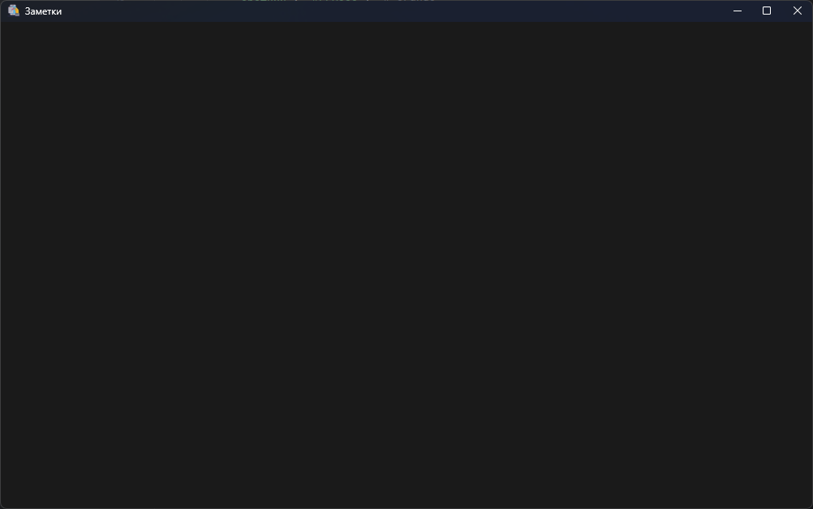

Добавим первый элемент на наше приложение. Пусть это будет заголовок, расположенный в верхнем левом углу экрана с некоторыми отступами.

Создаем дополнительный фрейм и помещаем его в наш основной фрейм
```python
self.title_frame = ctk.CTkFrame(self.main_frame, fg_color="transparent")
self.title_frame.pack(side=ctk.TOP, fill=ctk.X, padx=45, pady=5)
```

Как вы уже могли догадаться `side=ctk.TOP` - это метод позиционирования нашего элемента в приложении.

Теперь познакомимся с новым элементом управления - `Label`

```python
self.title_label = ctk.CTkLabel(
    self.title_frame,
    text="Заметки",
    font=("Poppins", 30, "bold"),
    text_color=self.colors["title_text"]
)
```

Теперь раскрываем магию. `Label` - это просто виджет текста!
Первым аргументом в наш класс мы передаем элемент, где будем размещать наш `Label`
`text` - то, что будем выводить
`text_color` - это цвет нашего текста
`font` - это шрифт нашего текста. Передается в виде кортежа, где первым аргументом указывается шрифт, который мы устанавливаем, вторым - его размер, а третьем - его начертание.

Добавим наш `Label`.
```python
self.title_label.pack(side=ctk.LEFT, anchor="nw", padx=10)
```

- anchor: помещает виджет в определенной части контейнера. Может принимать значения n, e, s, w, ne, nw, se, sw, c, которые являются сокращениями от Noth(север - вверх), South (юг - низ), East (восток - правая сторона), West (запад - левая сторона) и Center (по центру). Например, значение nw указывает на верхний левый угол

- side: выравнивает виджет по одной из сторон контейнера. Может принимать значения: TOP (по умолчанию, выравнивается по верхней стороне контейнера), BOTTOM (выравнивание по нижней стороне), LEFT (выравнивание по левой стороне), RIGHT (выравнивание по правой стороне).

- ipadx: устанавливает отступ содержимого виджета от его границы по горизонтали.

- ipady: устанавливают отступ содержимого виджета от его границы по вертикали.

- padx: устанавливает отступ виджета от границ контейнера по горизонтали.

- pady: устанавливает отступ виджета от границ контейнера по вертикали.

Запустим наше приложение.
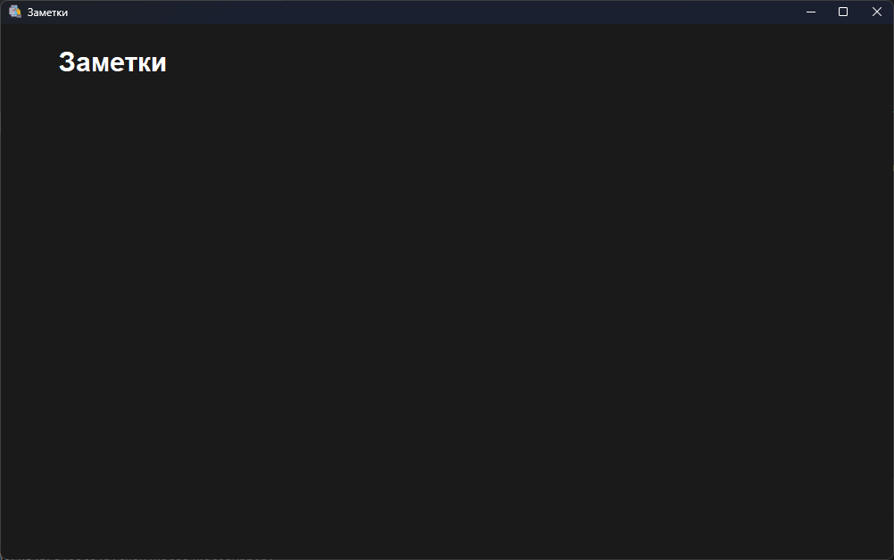

Как видим, наша надпись добавилась. Но просто надпись - это не интересно. Давайте добавим перед текстом изображение.

Для облегчения загрузки изображений в дальнейшем реализуем метод в нашем классе.
```python
def load_image(self, image_name: str, size: Tuple[int, int]) -> ctk.CTkImage:
    """Загружает изображение из папки images"""
    image_path = os.path.join(os.path.dirname(__file__), "images")
    full_path = os.path.join(image_path, image_name)
    return ctk.CTkImage(Image.open(full_path), size=size)
```

Немного объясню, что здесь происходит:
`__file__` — специальная переменная в Python, содержащая путь к текущему файлу скрипта.


`os.path.dirname(__file__)` возвращает директорию, в которой находится текущий файл.


`os.path.join(os.path.dirname(__file__), "images")` объединяет путь к директории текущего файла с поддиректорией `images`, получая полный путь к ней.


`os.path.join(image_path, image_name)` объединяет путь к директории `images` с именем файла изображения, указанным в параметре `image_name`, получая полный путь к файлу.

Далее, мы возвращаем объект класса `CTKImage`, загрузив наше изображение при помощи метода `open` класса `Image`.

>[!WARNING]
> Обратите внимание! Класс `Image` - это класс, используемый библиотекой `Pillow`, так что, дополнительно установите и импортируйте данную библиотеку **самостоятельно**!

> [!TIP]
> В конечном итоге ваш импорт будет выглядеть так!
> ```python
> from PIL import Image

После этого вернемся в наш `title` и добавим икону!
Для этого нам понадобится два параметра передать: `image` и `compound`

```python
image=self.load_image("notes.png", (40, 40)),
compound=ctk.LEFT,
```

В `image` мы загружаем наше изображение и устанавливаем ему размер `40x40`.
А `compound` - это положение нашего изображения относительно текста!
В результате у вас должно получится следующее!

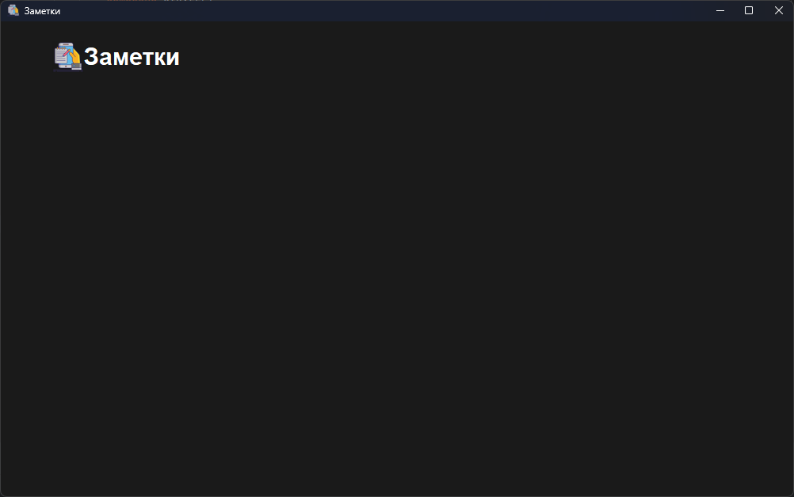

>[!CAUTION]
> Дабы избежать случаев, когда вы просто копируете изображение, увижу одинаковую иконку - **работу не принимаю!**

Теперь добавим следующий элемент на наше приложение. `Кнопка`

```python
self.add_button = ctk.CTkButton(
    self.title_frame,
    text="",
    image=self.load_image("plus.png", (35, 35)),
    width=0,
    fg_color="transparent",
    hover_color="#222",
    command=self.open_add_popup
)
self.add_button.pack(side=ctk.RIGHT, anchor="ne", padx=10)
```

Первым аргументом как обычно передаем место, куда будем добавлять нашу кнопку.
`text` в данном случае оставим пустым, так как наша кнопка - это будет изображение.
`image` - загружаем наше изображение
`width` - ширина нашей кнопки. Сделаем её 0, так как на изображение мы все равно сможем нажать.
`fg_color` - заливка фона нашей кнопки. В данном случае. я сделал его прозрачным.
`hover_color` - цвет кнопки при наведении. Немного затемним её.
`command` - обработчик нажатия на кнопку.

Добавим в наш код обработчик нажатия на кнопку, но временно сделаем из неё заглушку.
```python
def open_add_popup(self):
    """Открывает окно для добавления заметки"""
    pass
```


Следующий элемент, который нам понадобится - это место, где мы будем хранить все наши заметки. Стоит учесть, что наших заметок  может быть много. Поэтому, нужна прокручиваемая область, дабы пользователь мог увидеть все свои заметки.

В `CustomTkinter` за такое отвечает `CTkScrollableFrame`.
Добавим его в наше приложение.
```python
self.notes_frame = ctk.CTkScrollableFrame(self.main_frame, fg_color="transparent")
self.notes_frame.pack(side=ctk.TOP, fill=ctk.BOTH, expand=True, padx=40, pady=10)
```
**Параметр fill в Tkinter** определяет, будет ли виджет растягиваться, чтобы заполнить свободное пространство вокруг. 

Этот параметр может принимать следующие значения:
- **NONE** (по умолчанию, элемент не растягивается); 
- **X** (элемент растягивается только по горизонтали); 
- **Y** (элемент растягивается только по вертикали); 
- **BOTH** (элемент растягивается по вертикали и горизонтали).
`expand` - параметр, который определяет, будет ли виджет расширяться, чтобы занять дополнительное пространство контейнера.

Запустим и увидим следующее.
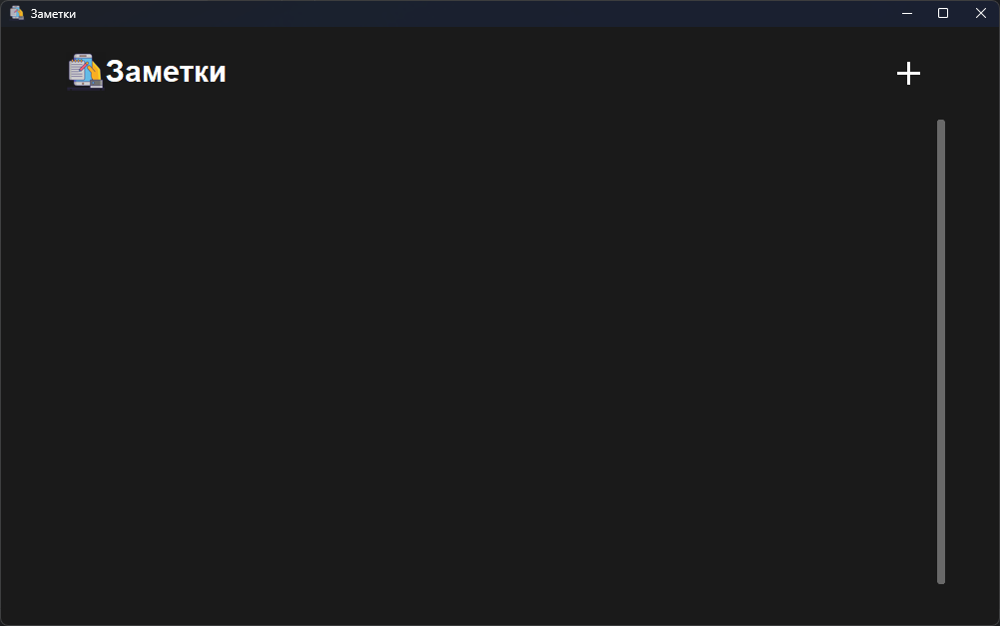

Как мы видим, появился тот самый `Scrollbar`,  значит, наш элемент добавился правильно. Чтобы лучше понять область данного элемента, давайте зададим ему `fg_color` другим цветом.
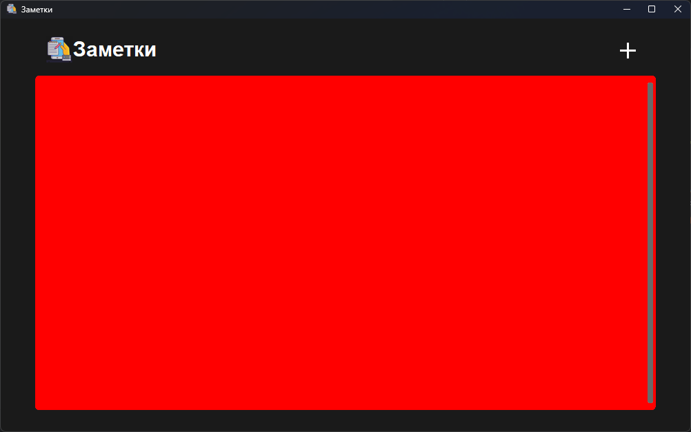

Вернемся к нашей кнопке добавления. Помните, мы задавали ей атрибут `command=self.open_add_popup`? Давайте его реализуем. А точнее, реализуем сразу два метода.

```python
def open_add_popup(self):
    """Открывает окно для добавления заметки"""
    self.open_note_popup(mode="add")
```

Странно, правда? Метод, который будет запускать внутри себя другой метод... Для чего такие сложности? Все довольно просто. Окно добавления заметки, идентично окну редактирования заметки, дабы следовать принципу `DRY (don’t repeat yourself / не повторяйтесь)` - фактически, наши методы будут схожи между собой, поэтому, в целях удобства, мы просто будем передавать некий параметр `mode` в наш метод `open_note_popup`, где в зависимости от режима, либо покажем окно добавления заметки, либо покажем это же окно, но с уже заполненными данными для редактирования существующей заметки.

Объявим наш метод `open_note_popup`.
```python
def open_note_popup(self, mode: str = "add", note_index: int | None = None) -> None:
	"""
	Универсальное окно для добавления или редактирования заметки.
	Если mode == "update", поля заполняются текущими данными заметки.
	"""
	pass
```
Как мы видим, в данный метод мы передаем 2 аргумента.
- `mode` - режим работы с нашей формой.
	- `add` - добавление новой заметки
	- `update` - редактирование существующей заметки
- `note_index` - id нашей заметки (для режима редактирования)

Реализуем наше модальное окно пока без различных полей ввода и т.д.
```python
def open_note_popup(self, mode: str = "add", note_index: int | None = None) -> None:
    """
    Универсальное окно для добавления или редактирования заметки.
	    Если mode == "update", поля заполняются текущими данными заметки.    """
	popup = ctk.CTkToplevel(self.root, fg_color=self.colors["bg"])
    popup.overrideredirect(True)
    toplevel_width = 500
    toplevel_height = 620

    root_width = self.root.winfo_width()
    root_height = self.root.winfo_height()
    root_x = self.root.winfo_rootx()
    root_y = self.root.winfo_rooty()
    x = root_x + (root_width - toplevel_width) // 2
    y = root_y + (root_height - toplevel_height) // 2
    popup.geometry(f"{toplevel_width}x{toplevel_height}+{x}+{y - 40}")
    popup.resizable(False, False)
    popup.attributes("-topmost", True)
    popup.grab_set()

	frame = ctk.CTkFrame(popup, fg_color=self.colors["note_frame"],
	border_color="#111", corner_radius=15)
    frame.pack(fill=ctk.BOTH, expand=True)

    # Заголовок окна
    header_frame = ctk.CTkFrame(frame, fg_color="transparent")
    header_inner = ctk.CTkFrame(header_frame, fg_color="transparent")
    header_text = "Добавить новую заметку" if mode == "add" else "Редактировать заметку"
    header_label = ctk.CTkLabel(
        header_inner,
        text=header_text,
        font=("IBM Plex Sans", 30, "bold"),
        text_color=self.colors["note_text"]
    )
    header_label.pack(side=ctk.LEFT, padx=10)
    close_btn = ctk.CTkButton(
        header_inner,
        text="",
        width=0,
        fg_color="transparent",
        hover_color="#333",
        image=self.load_image("x.png", (35, 35)),
        command=popup.destroy
    )
    close_btn.pack(side=ctk.RIGHT)
    header_inner.pack(side=ctk.TOP, fill=ctk.X, padx=20, pady=10)
    header_frame.pack(fill=ctk.X, pady=5)
```
В результате получится следующее
<p align="center">
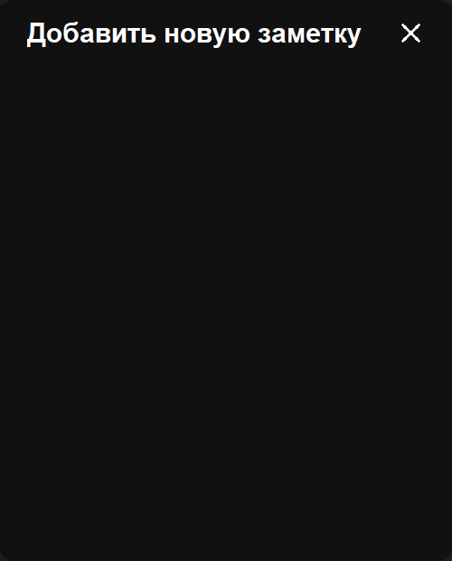
</p>

Немного пройдемся по коду:
`CTkToplevel` - Для создания диалогового окна, которое располагается поверх главного окна, применяется класс `CTKToplevel`. Toplevel по сути то же самое окно `CTk`, которое располагается поверх других окон.
`popup.overrideredirect(True)` - скрываем верхнюю панель, которая позволяла бы нам перетаскивать наше окно.

`popup.attributes("-topmost", True)` - закрепляем наш экран поверх других окон, передавая аргументом `-topmost`

Также добавим поле для ввода заголовка нашей заметки
```python
# Поле ввода заголовка
title_frame = ctk.CTkFrame(frame, fg_color="transparent")
title_lbl = ctk.CTkLabel(
    title_frame,
    text="Заголовок",
    font=("Poppins", 25, "bold"),
    text_color=self.colors["note_text"]
)
title_lbl.pack(side=ctk.TOP, anchor="nw", padx=30)
title_entry = ctk.CTkEntry(
    title_frame,
    height=60,
    placeholder_text="",
    font=("Poppins", 25),
    fg_color="transparent",
    border_color="#cdcdcd",
    text_color=self.colors["note_text"]
)
title_entry.pack(side=ctk.TOP, fill=ctk.X, padx=30, pady=10)
title_frame.pack(side=ctk.TOP, fill=ctk.X, pady=10)
```

А также поле ввода описания заметки
```python
# Поле ввода описания заметки
desc_frame = ctk.CTkFrame(frame, fg_color="transparent")
desc_lbl = ctk.CTkLabel(
    desc_frame,
    text="Описание",
    font=("Poppins", 25, "bold"),
    text_color=self.colors["note_text"]
)
desc_lbl.pack(side=ctk.TOP, anchor="nw", padx=30, pady=5)
desc_text = ctk.CTkTextbox(
    desc_frame,
    height=100,
    font=("Poppins", 25),
    fg_color="transparent",
    border_color="#cdcdcd",
    text_color=self.colors["note_text"],
    border_width=1
)
desc_text.pack(side=ctk.TOP, fill=ctk.BOTH, expand=True, padx=30, pady=10)
desc_frame.pack(side=ctk.TOP, fill=ctk.BOTH, expand=True, pady=5)
```

И кнопку сохранения заметки
```python
save_btn = ctk.CTkButton(
    frame,
    text="Сохранить заметку",
    fg_color=self.colors["button"],
    hover_color="#567DDC",
    font=("Poppins", 20),
    command=save_action
)
save_btn.pack(side=ctk.TOP, fill=ctk.X, ipady=15, pady=20, padx=30)
```

Как мы видим, у нас должен появиться новый метод: `save_action`
Просто задайте данный метод, но пока без реализации. Сделайте это **самостоятельно**
<p align="center">
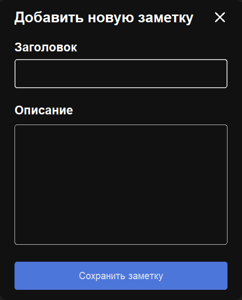
</p>


Просто для общего понимания, что в функцию, можно вложить другую функцию (метод), поработаем с этим в данном проекте. В реальном проекте, лучше избегать подобного поведения.

В нашем случае, функция `open_note_popup` берет на себя много обязанностей сразу.  Добавим в неё проверку, что если у нас установлен в режиме редактирования заметки и наша заметка в принципе существует, то будем добавлять в наши поля данные заметки.
```python
# Если редактирование, заполняем поля данными заметки
if mode == "update" and note_index is not None:
    note = self.notes[note_index]
    title_entry.insert(0, note["title"])
    desc_text.insert("1.0", note["description"])
```

Теперь самое сложно и немного непонятное. Внутри нашей функции `open_note_popup` реализуем функцию сохранения заметки. Назовем её `save_action`.

Получаем значения из наших полей заголовка и описания.
```python
title_val = title_entry.get().strip()
desc_val = desc_text.get("1.0", ctk.END).strip()
```

Как не сложно догадаться, методом `get()` мы получаем наше значение,  а функцией `strip` мы берем нашу строку, обрезаем лишние пробелы, символы и т.д и возвращаем `новую`, обработанную строку.

Далее, давайте проверим, что наши поля вообще заполнены. Дабы избежать добавления пустой заметки.

```python
if not title_val or not desc_val:
    return  # можно добавить сообщение об ошибке
```

Попробуйте добавить сообщение об ошибке самостоятельно. Это может быть как `MessageBox`, так и  какое-то интерактивное взаимодействие с нашими полями. Например, выделять их красным, с просьбой заполнить поле. Например, попробуйте добавиться такого результата **самостоятельно!**

<p align="center">
	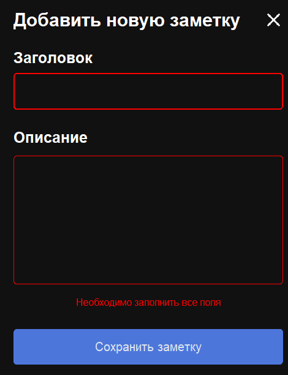
</p>

Далее, давайте добавим дату к нашей заметке.

```python
current_datetime = datetime.now()
formatted_time = current_datetime.strftime("%d.%m.%Y")
```

При помощи `strftime` мы форматируем нашу строку к понятному для российских пользователей формату.
- %d — день месяца в виде десятичного числа;
- %m — номер месяца;
- %Y — год с указанием века;

Дальше, будем проверять, добавляем ли мы заметку, или редактируем уже существующую.
Для удобства, мы будем хранить наши заметки в специальном `JSON` формате.
Если кратко, то `JSON` - это как словарь в Python.
В `JSON` данные хранятся в формате `'key`: 'value'`.
Поэтому, наша заметка будет представлять из себя объект, содержащий пару ключ - значение.

```python
new_note = {
    "title": title_val,
    "description": desc_val,
    "date": formatted_time,
    "timestamp": current_datetime.timestamp(),
}
```

Помните, мы объявили наш список для хранения заметок в классе? Так вот теперь мы начинаем активно с этим списком взаимодействовать. Давайте добавим нашу заметку в этот список при помощи метода `append()`

```python
self.notes.append(new_note)
```


Отлично, в памяти у нас заметка появилась. Теперь нам нужно сохранить её в `JSON` файл,

Для этого реализуем метод `save_note`. Для работы данного метода, нам необходимо импортировать библиотеку `json` в нашем файле.

```python
import json
```

```python
def save_notes(self):
    """Сохраняет заметки в файл JSON"""
    try:
        with open(NOTES_FILE, "w", encoding="utf-8") as f:
            json.dump(self.notes, f, ensure_ascii=False, indent=4)
    except Exception as e:
        print("Ошибка при сохранении заметок:", e)
```


`json.dump` - метод, который превратит из нашего словаря заметок в `JSON` формат данных.
`encoding` - устанавливаем кодировку для файла
`indent` - задаем уровень отступов

Работа с файлами у нас уже была на одном из занятий, на этом подробно останавливаться не буду.

Вот и весь метод добавления в файл, теперь вызовем наше метод, после того, как добавили нашу заметку в `list`.

```python
self.notes.append(new_note)
self.save_notes()
```

Если вы сейчас попробуете добавить заметку, то она у вас отобразится в вашем файле в следующем формате.

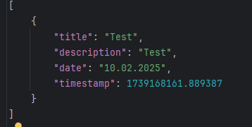

Но теперь нам нужно "отрисовать" наши заметки в нашем приложении. Для этого реализуем ещё один метод, который как раз и займется отрисовкой наших заметок.

```python
def display_all_notes(self):
    """Очищает и отображает заметки
    Обновление происходит в одном представлении (с использованием pack)."""
	for widget in self.notes_frame.winfo_children():
	    widget.destroy()
	sorted_notes = sorted(enumerate(self.notes))

	for idx, note in sorted_notes:
	    self.create_note_widget(note, idx)
```


С помощью конструкции
```python
    for widget in self.notes_frame.winfo_children():
        widget.destroy()
```

Мы проходим в цикле по всем дочерним элементам фрейма notes_frame (там, где мы храним заметки) и уничтожаем их для корректной перерисовки.

```python
self.create_note_widget(note, idx)
```

Метод для созданий реализуем следующим образом. Создаем рамку для нашей заметки.
```python
def create_note_widget(self, note, index):
    """Создает виджет для заметки"""
    note_frame = ctk.CTkFrame(
        self.notes_frame,
        fg_color=self.colors["note_frame"],
        border_color=self.colors["note_frame"],
        border_width=1
    )
    note_frame.pack(side=ctk.TOP, padx=10, fill=ctk.X, ipadx=10, ipady=5, pady=15)
```
Добавим заголовок и содержимое заметки
```python
# Заголовок заметки
title_label = ctk.CTkLabel(
    note_frame,
    text=note["title"],
    font=("Carbel", 28, "bold"),
    text_color=self.colors["note_text"]
)
title_label.pack(side=ctk.TOP, anchor="nw", padx=20, pady=5)

# Текст заметки (только для чтения)
description_box = ctk.CTkTextbox(
    note_frame,
    font=("Candera", 25, "bold"),
    text_color=self.colors["note_text"],
    fg_color="transparent",
    height=80
)
description_box.pack(side=ctk.TOP, fill=ctk.X, anchor="nw", padx=15, pady=1)
description_box.insert("1.0", note["description"])
description_box.configure(state="disabled")

# Панель управления заметкой

# Дата
info_frame = ctk.CTkFrame(note_frame, fg_color="transparent")
info_frame.columnconfigure(0, weight=1)
date_label = ctk.CTkLabel(
    info_frame,
    text=note.get("date", ""),
    text_color=self.colors["info_text"],
    font=("Carbel", 20)
)
date_label.grid(row=0, column=0, padx=20, pady=8, sticky="w")


return note_frame
```

Не забудьте вызвать данный метод.
```python
self.save_notes()
self.display_all_notes()
popup.destroy()
```
Метод `popup.destroy()` мы добавили, чтобы после успешного добавления заметки у нас закрывалось модальное окно.

Заметка у вас должна выглядеть следующем образом.
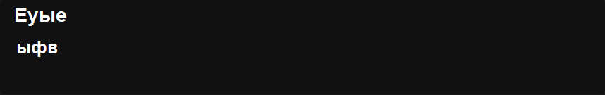
Отлично, методы реализованы, теперь мы можем добавлять заметки. Однако, давайте немного допишем нашу заметку, добавив в неё некую панель управления. А именно, кнопки редактирования заметки, кнопку удаления, копирования заметки.

>[!WARNING]
> Напоминаю, что данный код необходимо писать **до ключевого слова** `return`


Допишем наш метод:
```python
# Кнопка редактирования
edit_btn = ctk.CTkButton(
    info_frame,
    text="",
    image=self.load_image("edit.png", (30, 30)),
    compound=ctk.LEFT,
    fg_color="transparent",
    width=0,
    hover_color="#444",
    command=lambda idx=index: self.open_update_popup(idx)
)
edit_btn.grid(row=0, column=3, padx=5)
CTkToolTip(edit_btn, message="Редактировать заметку")

# Кнопка удаления
delete_btn = ctk.CTkButton(
    info_frame,
    text="",
    image=self.load_image("trash.png", (30, 30)),
    compound=ctk.LEFT,
    fg_color="transparent",
    width=0,
    hover_color="#444",
    command=lambda idx=index: self.delete_note(idx)
)
delete_btn.grid(row=0, column=4, padx=5)
CTkToolTip(delete_btn, message="Удалить заметку")

# Кнопка копирования текста заметки в буфер обмена
copy_btn = ctk.CTkButton(
    info_frame,
    text="",
    image=self.load_image("copy.png", (30, 30)),
    compound=ctk.LEFT,
    fg_color="transparent",
    width=0,
    hover_color="#444",
    command=lambda idx=index: self.copy_note_text(idx)
)
copy_btn.grid(row=0, column=5, padx=5)
CTkToolTip(copy_btn, message="Скопировать текст заметки")

info_frame.pack(side=ctk.BOTTOM, fill=ctk.X, padx=5)
```
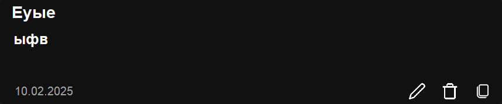
### Методы `copy_note_text` и `delete_note` пока реализуйте заглушками! Точно также, как мы делали с методом `open_add_popup`, когда начали его реализовывать.

Реализуем метод редактирования заметки. Вернемся к нашему методу `save_action()`
и в блоке, где мы создаем новую заметку (`new_note`) отредактируем наш код следующим образом:
```python
if mode == "add":
    new_note = {
        "title": title_val,
        "description": desc_val,
        "date": formatted_time,
        "timestamp": current_datetime.timestamp(),
    }
    self.notes.append(new_note)
elif mode == "update" and note_index is not None:
    self.notes[note_index] = {
        "title": title_val,
        "description": desc_val,
        "date": formatted_time,
        "timestamp": current_datetime.timestamp(),
    }
self.save_notes()
self.display_all_notes()
popup.destroy()

save_btn = ctk.CTkButton(frame,
                          text="Сохранить заметку",
                          fg_color=self.colors["button"],
                          hover_color="#567DDC",
                          font=("Poppins", 20),
                          command=save_action)
save_btn.pack(side=ctk.TOP, fill=ctk.X, ipady=15, pady=20, padx=30)
```

Попробуйте отредактировать существующую заметку.
<p align="center">
	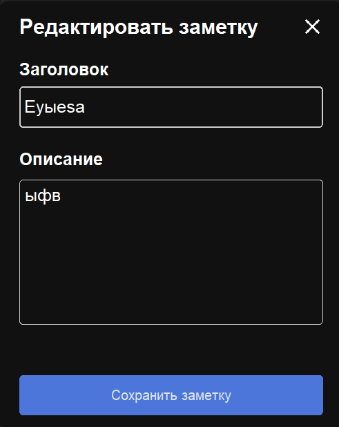
</p>

Реализуйте метод delete_note() **самостоятельно**.

# Задание на самостоятельное выполнение

1. Познакомьтесь с дополнительной библиотекой `CTkToolTip`, которая позволяет добавить всплывающие подсказки к элементам. Добавьте логические подсказки на каждый элемент.  Пример ниже

<p align="center">
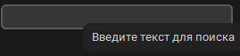
</p>
