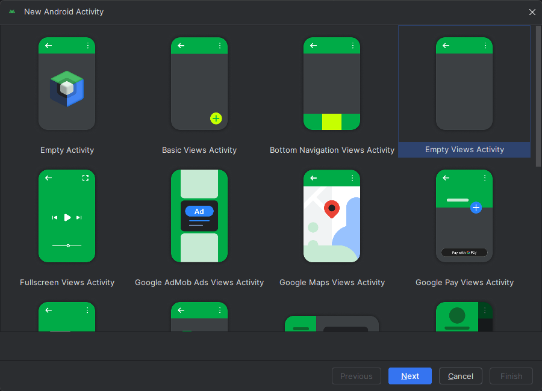

__Практическая работа №1__
===

Создание нового проекта

1. Отлично, теперь давайте создадим наш первый проект.
2. Запускаем Android Studio и нажимаем "New Project"

    

3. Дальше представлена куча вариаций для создания нового "Activity", но в рамках практической нам достаточно пока будет выбрать "Empty View Activity".

    

4. Далее мы устанавливаем название нашего будущего приложения.

__Name__ - имя нашего пакета

__Package name__ - можно сказать, что это __уникальное__ название нашего будущего приложения. Данный нейминг обычно подразумевает собой домен компании в обратном порядке (например, если сайт имеет домен ozon.ru, то название пакета будет ru.ozon.<название приложения>).

__Save location__ - расположение, где будет находится ваш будущий проект.

__Minimum SDK__ - минимальная версия SDK  приложения. Чем ниже версия API, тем больший процент смартфонов затронет ваше приложение, однако, взамен этому, вы теряете новые "фичи" в последних версиях. При выборе версии SDK вы увидите процент, на скольких % устройств запустится ваше приложение.

    

5. Поздравляю, вы только что создали свой первый проект в Android Studio.
Однако, так как мы с вами современные разработчики, и работаем на Kotlin, будем использовать и новые подходы к разработке. Но это уже в следующей практической :) В ходе практических, разработаем с вами приложение для замеиток. Оно поможет вам понять базовые принципы программирования, а также основы работы с БД.

    

