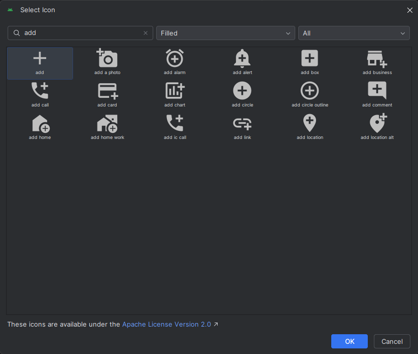

__Практическая работа №3__
===

Отслеживание состояний Активности. Использование значений строк и цветов


1. Давайте немного поработаем с цвтеами нашего будущего приложения. Перейдите в директорию <code>res -> values -> colors.xml</code>
<div style="text-align:center">
    
</div>
Данный файл отвечает за хранение цветов в нашем приложении. Гораздо удобнее обратиться к цвету по его названию, которое придумал разработчик, чем каждый раз писать HEX, или RGb код цвета.

Добавим в данный файл следующую строчку
```xml
<color name="primary_color">#288dff</color>
```
Назвать вы его можете, как угодно, но __помните: всегда давайте переменным осмысленное значение__
<div style="text-align:center">
    
</div>

2. Теперь перейдите в этой же директории в файл <code>themes.xml</code>
Преобразуйте файл к следующему виду:
```xml
<?xml version="1.0" encoding="utf-8"?>
<resources>
    <style name="Theme.KKRitAndroidLabs" parent="android:Theme.Material.Light.NoActionBar">
        <item name="colorPrimary">@color/primary_color</item>
        <item name="android:statusBarColor">@color/primary_color</item>
    </style>
</resources>
```
Как можно понять по названию, данный файл позволяет нам создавать темы для нашего приложения. Вы можете создать, например, темную и светлую версию вашего приложения.
И например, переопределить colorPrimaty в темной версии темы.

3. Добавим в наш проект парочку SVG ассетов. Для этого нажмите ПКМ по папке <code>drawable -> New -> Vector Asset</code>
<div style="text-align:center">
    
</div>

4. Нажмите по пункту <code>Clip art</code> и введите в поиске запрос <code>Add</code>
<div style="text-align:center">
    
</div>

5. Аналогично добавьте иконку <code>Done</code>

6. Добавляем <code>Drawable Resource File</code>
<div style="text-align:center">
    
</div>

7. В названии вставляем <code>primary_button</code> (или любое другое, какое удобнее вам)
8. В root Element выставляеми <code>Shape</code>
<div style="text-align:center">
    
</div>

9. Создадим разметку нашей будущей кнопки
```xml
<?xml version="1.0" encoding="utf-8"?>
<shape xmlns:android="http://schemas.android.com/apk/res/android" android:shape="rectangle">
    <stroke
        android:width="1dp"
        android:color="@color/primary_color"
        />
    <corners
        android:radius="8dp" />
</shape>
```
