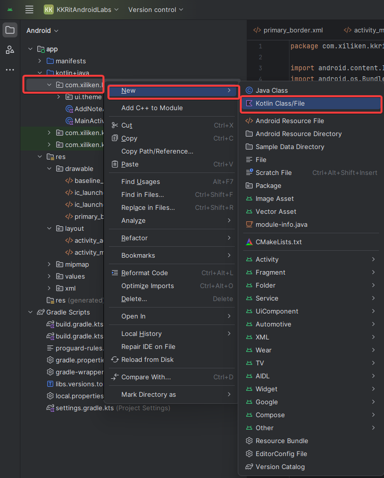
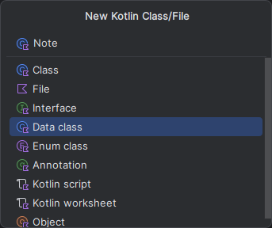
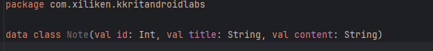

__Практическая работа №4__
===
1.Теперь добавим новое <code>Empty View Activity</code>
<div style="text-align:center">
    
</div>
<div style="text-align:center">
    
</div>
2. Добавим на главное активити кнопку, для добавления будущей заметки.
В папке <code>layout</code> изменим код <code>main_activity.xml</code> следующим образом

```xml
<?xml version="1.0" encoding="utf-8"?>
<RelativeLayout
    xmlns:android="http://schemas.android.com/apk/res/android"
    xmlns:app="http://schemas.android.com/apk/res-auto"
    xmlns:tools="http://schemas.android.com/tools"
    android:layout_width="match_parent"
    android:layout_height="match_parent"
    tools:context=".MainActivity">

    <com.google.android.material.floatingactionbutton.FloatingActionButton
        android:id="@+id/addButton"
        android:layout_width="wrap_content"
        android:layout_height="wrap_content"
        android:layout_alignParentBottom="true"
        android:layout_alignParentEnd="true"
        android:layout_margin="16dp"
        android:src="@drawable/baseline_add_24"
        android:tint="@color/white"
        android:backgroundTint="@color/primary_color" />
</RelativeLayout>
```
<div style="text-align:center">
    
</div>
3. Теперь изменим код <code>activity_add_note.xml</code>

```xml
<?xml version="1.0" encoding="utf-8"?>
<RelativeLayout
    xmlns:android="http://schemas.android.com/apk/res/android"
    xmlns:app="http://schemas.android.com/apk/res-auto"
    xmlns:tools="http://schemas.android.com/tools"
    android:id="@+id/main"
    android:layout_width="match_parent"
    android:layout_height="match_parent"
    android:orientation="vertical"
    android:padding="16dp"
    tools:context=".AddNoteActivity">

    <TextView
        android:id="@+id/addNoteHeader"
        android:layout_width="wrap_content"
        android:layout_height="wrap_content"
        android:layout_alignParentTop="true"
        android:layout_marginTop="16dp"
        android:text="Добавить запись"
        android:textColor="@color/primary_color"
        android:textSize="24sp"/>

    <ImageView
        android:id="@+id/saveButton"
        android:layout_width="wrap_content"
        android:layout_height="wrap_content"
        android:src="@drawable/baseline_add_24"
        android:layout_alignParentEnd="true"
        android:layout_alignTop="@+id/addNoteHeader"
        android:layout_marginEnd="6dp"/>

    <EditText
        android:id="@+id/titleEditText"
        android:layout_width="match_parent"
        android:layout_height="60dp"
        android:hint="Название"
        android:padding="12dp"
        android:textSize="20sp"
        android:layout_below="@+id/addNoteHeader"
        android:background="@drawable/primary_border"
        android:layout_marginTop="16dp"
        android:maxLines="1"/>

    <EditText
        android:id="@+id/contentEditText"
        android:layout_width="match_parent"
        android:layout_height="match_parent"
        android:layout_below="@+id/titleEditText"
        android:layout_marginTop="12dp"
        android:background="@drawable/primary_border"
        android:gravity="top"
        android:hint="Описание"
        android:padding="12dp"
        android:textSize="18sp" />

</RelativeLayout>
```
<div style="text-align:center">
    
</div>

<blockquote><b>Для дальнейше работы, перейтдите в директорию</b> <code>Gradle -> build.Gradle (Module: app)</code></blockquote>

Добавьте в секцию buildFeatures параметр <code>viewBinding = true</code>

```json
    buildFeatures {
        compose = true
        viewBinding = true
    }
```

Теперь вернеся в наш <code>main_activity.xml</code> и приведем его к следующему виду</code>
```kotlin
class MainActivity : AppCompatActivity() {

    // Объявление переменной для связывания с представлением (View) через View Binding
    private lateinit var binding: ActivityMainBinding

    override fun onCreate(savedInstanceState: Bundle?) {
        super.onCreate(savedInstanceState)
        // Создаем экземпляр binding на основе layout файла activity_main.xml
        binding = ActivityMainBinding.inflate(layoutInflater)
        // Включение режима edge-to-edge (по краям) для полной растяжки контента
        enableEdgeToEdge()
        //setContentView(R.layout.activity_main)
        // Установка главного контента нашего Activity через корневую часть binding
        setContentView(binding.root) // Заменено

        // Устанавливаем обработчик клика для кнопки добавления заметки
        binding.addButton.setOnClickListener {
            // При нажатии на кнопку, создаем новый интент для перехода на AddNoteActivity
            val intent = Intent(this, AddNoteActivity::class.java)
            // Запускаем новое Activity
            startActivity(intent)
        }
    }
}
```

Теперь давайте создадим <code>data-class</code> для нашей заметки.
<blockquote>Если коротко сказать, то как правило, такие классы предназначены для хранения некоторого состояния, некоторых данных и когда не требуется какое-то поведение в виде функций.</blockquote>

Для создания data класса нажмите ПКМ по вашему основному пакету в проекте, <code>New -> Kotlin Class / File</code>

<div style="text-align:center">
    
</div>

Выберите <code>DataClass</code> и назовите его <code>Note</code>
<div style="text-align:center">
    
</div>
Заполним наш <code>data class</code> следующими атрибутами:

```kotlin
data class Note(val id: Int, val title: String, val content: String)
```

<div style="text-align:center">
    
</div>
