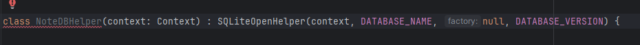
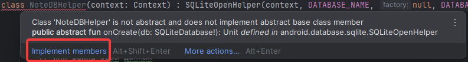
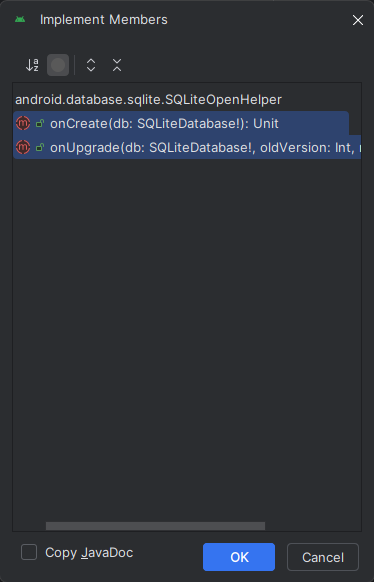

__Практическая работа №5__
===
Подключение SQLite к проекту

Давайте подключим Базу данных к нашему приложению для заметок.
1. Создадим класс для работы с Базой данных SQLite.
2. Создадим новый Kotlin класс, назвав его NoteDBHelper

Определим в данном классе <code>companion объекты</code>. Чтобы было понятно, что это:
<blockquote>companion-объекты. companion-объект определяется внутри некоторого класса и позволяет определить свойства и методы, которые будут общими для всех объектов этого класса. В ряде языков программирования есть похожая концепция - статические поля/свойства и методы. То есть companion-объекты определяют свойства и методы класса в целом, а не объекта.</blockquote>

То есть, такие объекты позволяют нам получить доступ к атрибутам класса, не создавая его экземпляр.

__Если что-то не понятно, посмотрите лекцию по ООП__

Также, для работы с базой данных нам необходимо наследоваться от класса <code>SQLiteOpenHelper</code> из пакета
<code>import android.database.sqlite.SQLiteOpenHelper</code>

Преобразуем класс к следующему виду:

```kotlin
class NoteDBHelper(context: Context) : SQLiteOpenHelper(context, DATABASE_NAME, null, DATABASE_VERSION) {

    // Определяем общий объект, содержащий константы, которые будут использоваться в классе
    companion object {
        // Имя файла базы данных
        private const val DATABASE_NAME = "db.sqlite"
        // Версия базы данных (изменяется при обновлении схемы)
        private const val DATABASE_VERSION = 1
        // Имя таблицы для хранения заметок
        private const val TABLE_NAME = "notes"

        // Имена колонок в таблице
        private const val COLUMN_ID = "id"              // Уникальный идентификатор заметки
        private const val COLUMN_TITLE = "title"        // Заголовок заметки
        private const val COLUMN_CONTENT = "content"    // Содержимое заметки
    }
}
```

В данном классе мы определили приватные константы для настройки подключения к БД. Обычно, это название базы данных, название хост (ip адресс), где находится наша БД, пользователь для подключения к БД, а также пароль от БД. Но в случае SQLite, так как она локальная, нам достаточно только названия базы данных.

Но так, как это Helper для работы с заметками, мы сразу указываем название будущей таблицы, а также все поля данной таблицы. Это поможет программисту быстро изменить название нужных колонок, без необходимости выискивать их в SQL запросе.


Однако, после приведения дата класса к такому виду, вы увидите, что наш дата класс начал подсвечиваться красным цветом.
<div style="text-align:center">
    
</div>

Это связано с тем, что <code>SQLiteOpenHelper</code> требует обязательной реализации двух методов <code>onCreate</code>, который вызывается при создании таблице БД. А также <code>onUpgrade</code> который вызывается при обновлении базы данных. Чтобы это исправить, необходимо реализовать работу этих двух мтеодов. Самый быстрый способ это сделать - навести на ключевое слово <code>class</code> и нажать <code>implement members</code>
<div style="text-align:center">
    
    
</div>

В конечном итоге в файл добавится 2 новых метода. Это так называемая __перегрузка методов__

```kotlin
    override fun onCreate(db: SQLiteDatabase?) {
        TODO("Not yet implemented")
    }

    override fun onUpgrade(db: SQLiteDatabase?, oldVersion: Int, newVersion: Int) {
        TODO("Not yet implemented")
    }
```
Давайте реализуем данные методы:

<code>onCreate</code>
```kotlin
    override fun onCreate(db: SQLiteDatabase?) {
        // SQL-запрос для создания таблицы заметок
        val createTableSQL = """
            CREATE TABLE $TABLE_NAME (
                $COLUMN_ID INTEGER PRIMARY KEY AUTOINCREMENT,
                $COLUMN_TITLE TEXT NOT NULL,
                $COLUMN_CONTENT TEXT NOT NULL
            )
        """.trimIndent()
        // Выполнение SQL-запроса для создания таблицы в базе данных
        db?.execSQL(createTableSQL)
    }
```

<code>onUpgrade</code>
```kotlin
    override fun onUpgrade(db: SQLiteDatabase?, oldVersion: Int, newVersion: Int) {
        // SQL-запрос для удаления таблицы, если она существует (вызывается при обновлении версии базы данных)
        db?.execSQL("DROP TABLE IF EXISTS $TABLE_NAME")
        // Создание новой таблицы
        onCreate(db)
    }
```


И на последок давайте реализуем метод доабвления новой заметки, а также протестируем созданную модель.
```kotlin
    fun addNote(note: Note) {
        // Открываем подключение к базе данных в режиме записи
        val db = writableDatabase

        // Создаем объект ContentValues для хранения пар «ключ-значение»
        val values = ContentValues().apply {
            // Добавляем заголовок и содержание заметки
            put(COLUMN_TITLE, note.title)    // Записываем заголовок заметки в значения
            put(COLUMN_CONTENT, note.content) // Записываем содержимое заметки в значения
        }

        // Вставляем данные в таблицу и закрываем сессию с базой данных
        db.insert(TABLE_NAME, null, values) // Выполняем вставку данных в таблицу TABLE_NAME
        db.close() // Закрываем подключение к базе данных, чтобы освободить ресурсы
    }
```
