__Практическая работа №1__
===

Установка программного обеспечения, необходимого для разработки приложений на ОС Android (настройка Eclipse и Android SDK. Создание виртуального устройства для проверки работоспособности приложений).

1. Скачиваем Android Studio с официального сайта https://developer.android.com/studio

    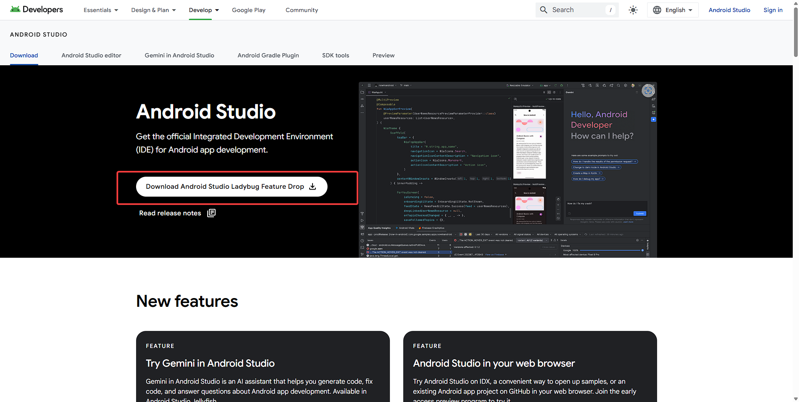
    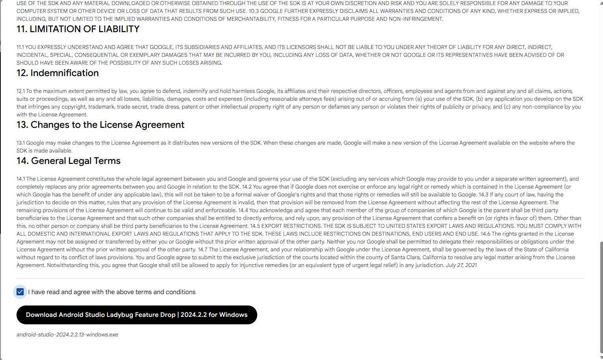

2. Далеее устанавливаем, как самую обычную программу на Windows. В первом окне нажимаем "Next".

    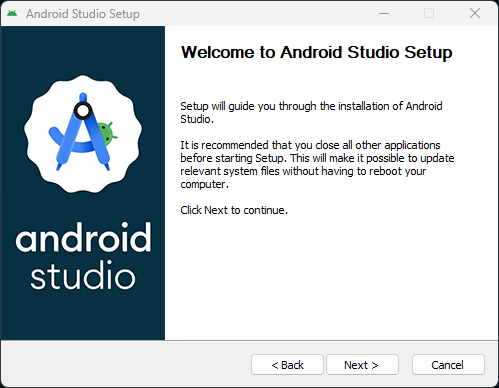

3. Обязательно проверьте, чтобы был выбран пункт с Android Virtual Device - это наш будущий эмулятор. (Но если что, его потом можно будет доустановить отдельно)

    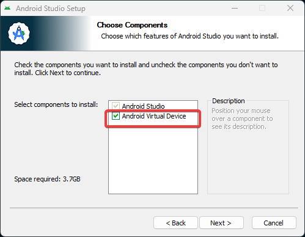

4. Выберите путь установки будущего приложения.

    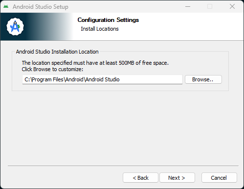

5. Просто нажмите "Next"

    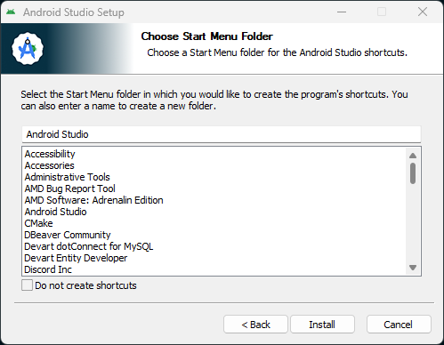

6. Завариваем чаек и дожидаемся окончания установки. 😊

    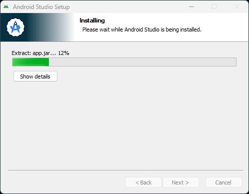

7. После окончания установки и запуска приложения, Вас встретит окно, предлагающая отправку анонимной статистики об использовании и сбоях в работе Android Studio.

    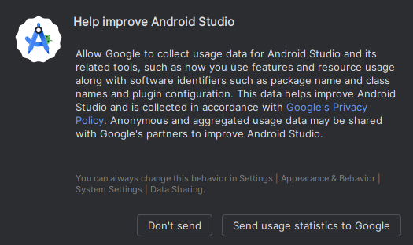

P.S: Для любителей Linux, вот видео с официальной странице по установке на примере Bubuntu

<video width="100%" height="100%" controls style="text-align: center;">
  <source src="./data/studio-install-linux.mp4" type="video/mp4">
</video>

8. После установки, главное окно программы будет выглядеть примерно вот так:

    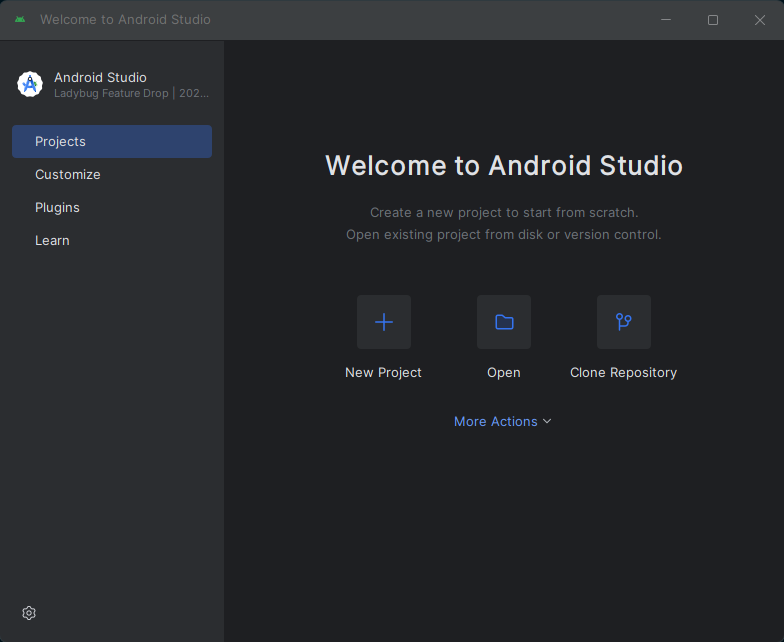

10. Для проверки работы виртуального девайса нажмите по ссылке "More actions", и выберите пункт "Virtual Device Manager" (VDM)

    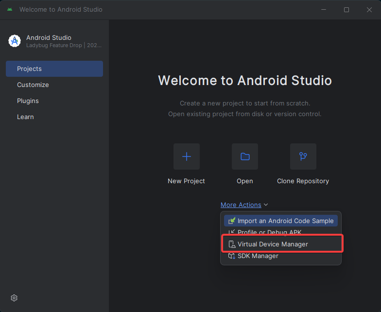

11. Создайте новое устройство любым удобным для вас способом

    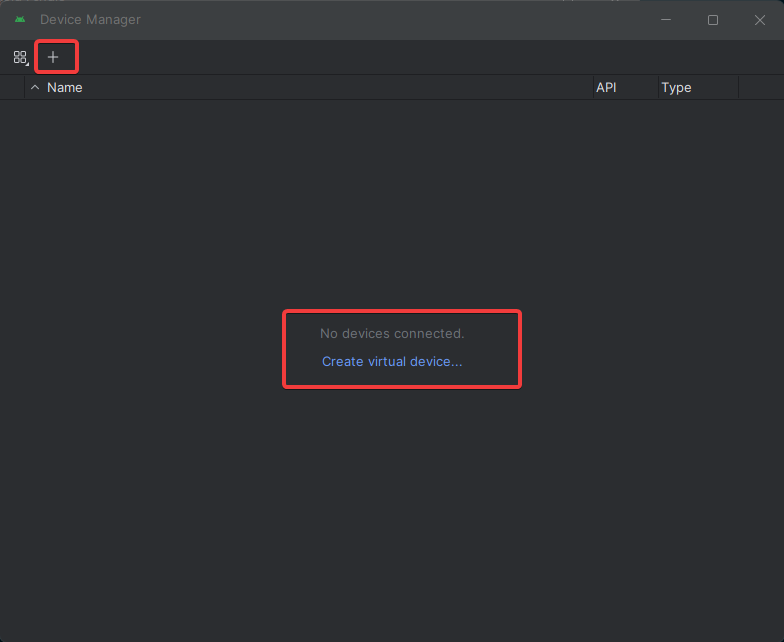

12. Нас будет интерисовать вкладка "Phone". Можете выбрать любое доступное устройтсво.

    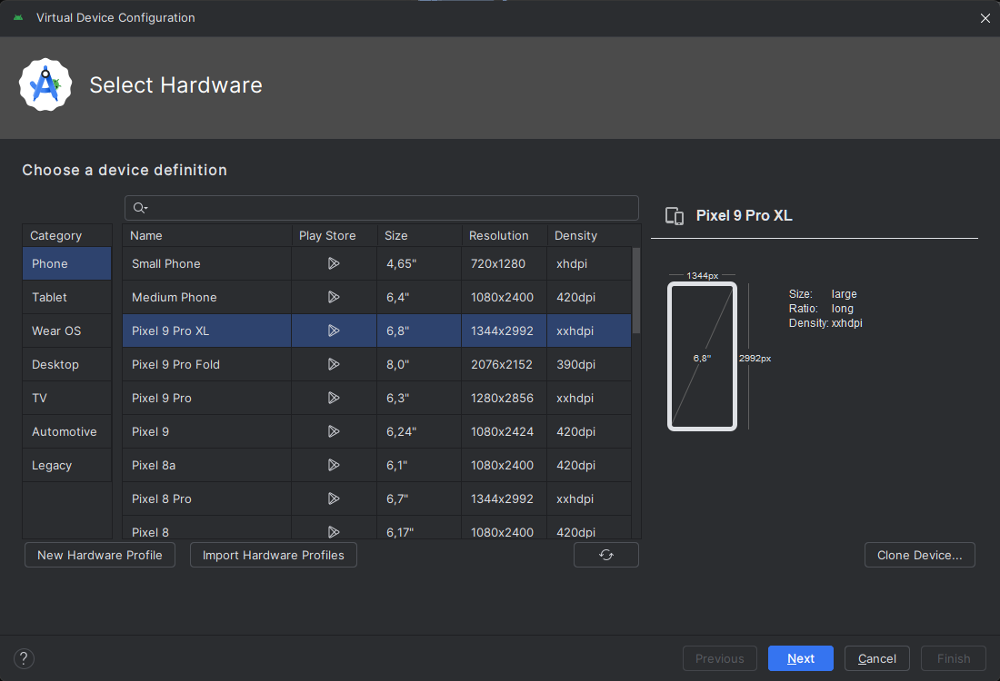

13. Следующий этап предполагает выбор версии Api. Т.е Api 35 уровня, относится к  Anrdoid 15, 34 к Android 14  и т.д. Выберите интерисующую вас версию Api.

    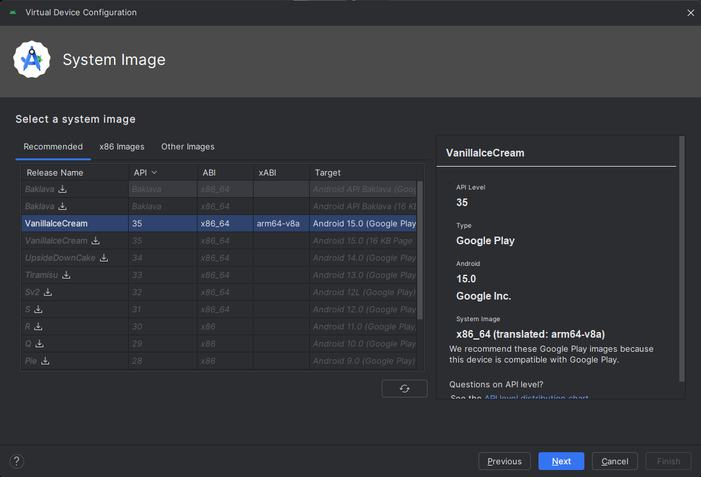

14. Слеюущий экран показывает нам финальные настройки нашего виртуального девайса,которые также можно изменить, но в рамках практики это не понадобится. Поэтому смело нажимаем "Finish".

    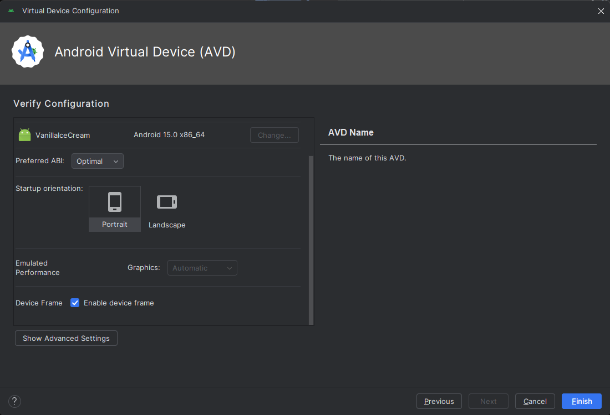

15. Наш вирутальный девайс создан, теперь мы можем его запустить.

    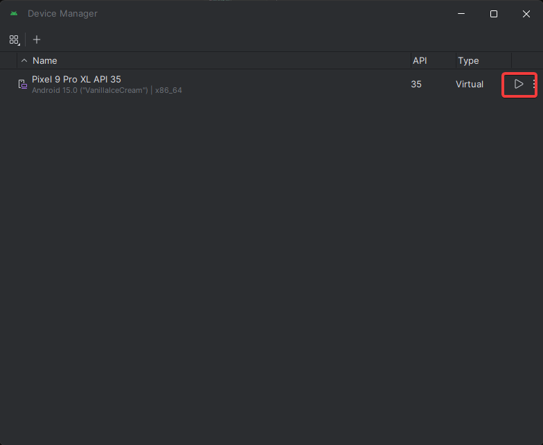

16. Поздравляю, вы только что запустили ваш первый эмулятор андройд смартфона для разработки!

    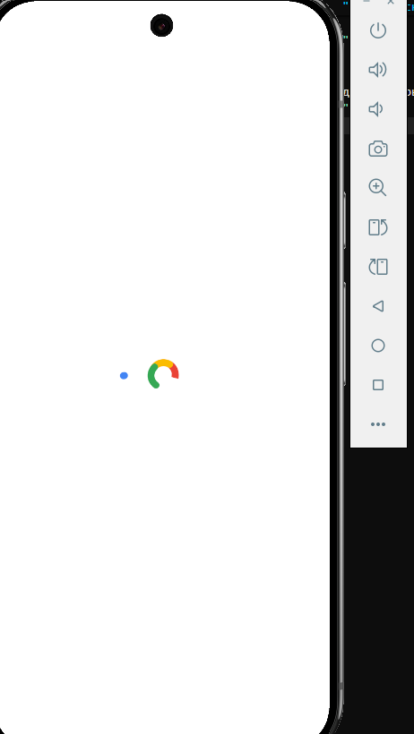

